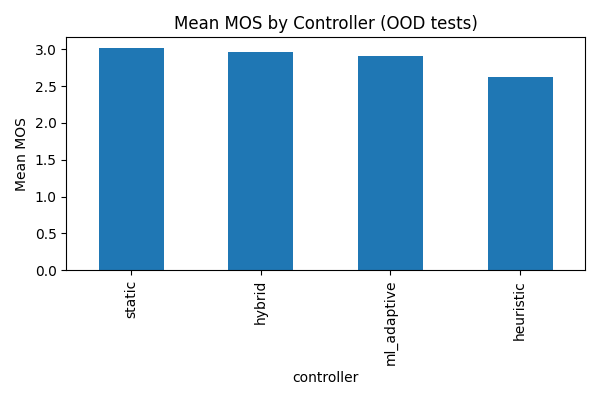
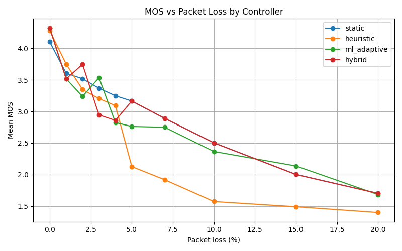

# Out-of-Distribution Test Report

Summary of OOD sweep results. Generated plots below.

## Mean MOS by Controller

## MOS vs Packet Loss

## Top-2 runs per input file
| input_file          | controller   |   packet_loss_perc |     mos |   bitrate |   frame_size |   complexity | use_fec   |
|:--------------------|:-------------|-------------------:|--------:|----------:|-------------:|-------------:|:----------|
| beep_440.wav        | heuristic    |                  0 | 4.07642 |        48 |           20 |            5 | False     |
| beep_440.wav        | ml_adaptive  |                  0 | 4.07555 |        48 |           40 |            5 | False     |
| wild_speech_sim.wav | hybrid       |                  0 | 4.56714 |        48 |           40 |            9 | False     |
| wild_speech_sim.wav | ml_adaptive  |                  0 | 4.56714 |        48 |           40 |            9 | False     |